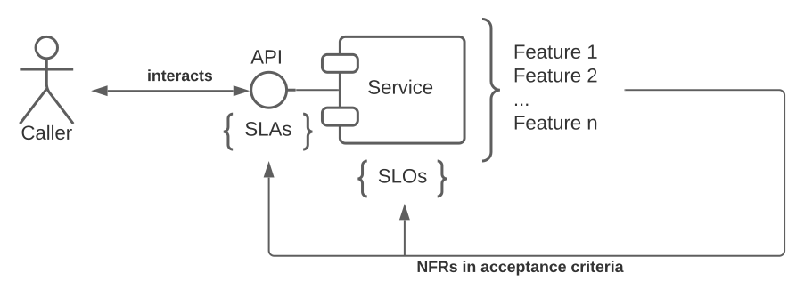

# Introduction
This project provides practical guidance for systems/software engineers and teaching material for a graduate level course regarding non-functional requirements (NFRs). The following topics are covered:

- Classification of requirements and explanation why NFRs are so important.
- The Planguage and its benefits.
- Tool support in managing requirements including NFRs.
- Patterns and templates for implementing NFRs in a software system.
- Usage of [slidev](https://sli.dev/) in creating presentations in developer friendly manner that is hosted as a static website via [GitHub Pages](https://pages.github.com/).

**💡 Visit the [website](https://evarga.github.io/nfrs-guide/) about how NFRs drive software evolution and why should you read the rest of this text!**

The term non-functional may resonate as something non-important or related to things outside the core value stream. This is a huge blunder, as NFRs shape the architecture, and they are vital for expanding market share as well as ensuring customer retention. Some authors even refrain to use this term and many process frameworks call them supplementary or supporting requirements. We will stick to the term NFR in this project.

In software development _validation_ and _verification_ are two complementary viewpoints on all activities that are driven by requirements:
- Validation encompasses all activities for ensuring that we are building the right thing. This is the phase when requirements (both functional and NFRs) are rigorously examined for any conflicts and assurances collected that they meet customer's needs.
- Verification is a set of activities for checking whether we are building the product right. This entails establishing quality gates to avoid bugs including those associated with departing from requirements, missing them, or simply wrongly implementing the system. For example, the company could improperly design and construct the product, so the system turns out to be too slow to meet performance aspects. This can happen even if all performance related NFRs were impeccably specified.

Accurately specifying requirements and using industry best practices & patterns are vital for validation and verification activities. This documents tries to cover both aspects.

## Prerequisites
Before we plunge into the realm of NFRs it is beneficial to give some guidance how requirements differ from user stories and what is the difference between user requirements and system/software requirements. Below is a set of curated references that should be studied:
- The article [Business, User, and System Requirements](https://enfocussolutions.com/business-user-and-system-requirements) explains the three major categories of requirements. Software requirements are defined in the context of system requirements, as the latter encompasses a whole system where software is only part of it.
- The blog [User Stories vs. Requirements](https://www.aha.io/blog/user-stories-vs-product-requirements) nicely recaps how user stories are not the same as requirements. The former may be regarded as a template/placeholder for future requirements. User stories organically transform into product requirements as developers start working on them in sprints.
- The article [Use cases vs user stories in Agile development](https://www.boost.co.nz/blog/2012/01/use-cases-or-user-stories) elaborates about another topic that frequently confuses people. User stories gradually incorporate missing details via attached acceptance criteria while use cases are better to capture behavioral requirements in a more detail. They are especially useful where formality matters, as describing interaction among the product and actors motivates stakeholders to discover alternate flows (edge cases) earlier. Sometimes handling these exceptions produces a bigger impact on the overall architecture than the main scenario. Furthermore, use cases may be visualized through UML use case and/or user journey diagrams where one can clearly emphasize the scope of a product and model actors.
- Finally, the last missing piece is illuminated in this post [The definition of done and acceptance criteria: What’s the difference?](https://www.boost.co.nz/blog/2019/04/difference-definition-done-acceptance-criteria), where the dissimilarities between *acceptance criteria* and *definition of done* are exemplified. The latter is something that is left to teams to specify, although there is a need to take a broader perspective including business criticality of applications. All work performed by teams impacting any component inside a mission-critical application must happen under more stringent definition of done compared to work done on a non-mission-critical application. The expense of fixing bugs rises exponentially as time passes by and requirements related bugs are hardest to remedy, as depicted in the [Defect Cost Increase](https://www.construx.com/resources/software-developments-defect-cost-increase-poster/) poster.

# Classification of NFRs
There are two broad categories of NFRs:
- **Product** - usual understanding of NFRs related to a solution. 
- **Process** - kind of meta NFRs pertaining to a development process.

## Product Oriented NFRs
Product related NFRs are encompassed in most well-established industry processes (like in [SAFe](https://scaledagileframework.com/nonfunctional-requirements)). We can differentiate two groups of NFRs that characterize quality:
- **External** - usability, performance, reliability, availability, security, etc. 
- **Internal** - scalability, portability, supportability, testability, etc.

The external attributes are usually perceivable by an end user, while the internal are enablers for a business to flourish. Both classes are equally important. If the system is not maintainable, then improvements, expansions, adaptations are all painful activities. Here are some examples of external NFRs (we will later dig deeper into how to express NFRs in a more precise manner):
- Performance: _Response time should be less than 1 second to display or refresh a webpage with order items_.
It is important to recognize that nobody should claim that this is purely a UI requirement. For a user to promptly see open order items all associated back-end services must run fast enough.
- Availability: _99.99% uptime during peak business hours (depends on a customer's region)_.
- Usability: _Frequent actions must be easily accessible from a UI via customizable keyboard shortcuts and toolbar_.
Usability tests are very hard to be fully automated. This is the territory where manual testing is still prevalent. It is not an uncommon practice to borrow usability requirements from external sources by mandating that specific UX guidelines should be followed[^1].

### Minimally Viable Set of Quality Attributes
There is a common set of important quality attributes abbreviated as FURPS+ (Functionality, Usability, Reliability, Performance, and Supportability). Functionality is about what the system should do, while NFRs tell how well it must perform the work. An architecture of a software system is profoundly responsible to address NFRs. If we wouldn't care about them, then functionality could be delivered in any manner, most would be useless. An excellent source of information about FURPS+ is the [OpenUP](https://www.utm.mx/~caff/doc/OpenUPWeb/) framework[^2].

#### Security as Technical Functionality
One of the reasons that functionality (denoted as F) in the FURPS+ quality model encompasses security is that security aspects of an application are directly perceivable by users of a system and often explicitly demanded as such. For example, account registration and management, login/logoff possibility, handling permissions (authorization), encryption of data, etc. are all things that are specified alongside other features. On the other hand, it is rarely the case that users would specify how documentation or supporting help system should be crafted, although if they turn out to be cumbersome, then users would rate usability lower.

A huge misconception in system development, which is attempted to be remedied by the FURSP+ model, is that security could be incorporated as an afterthought into a software. Security cannot be tuned like performance or improved via refactoring activities, which work so well to boost maintainability. Security concerns and requirements must be considered from the very beginning and materialize in form of core features of a system. Try the [Secure Code Game](https://github.com/skills/secure-code-game) challenges to get a better understanding of how security is interwoven with other aspects of software development.

### Taxonomy of Product Related NFRs
NFRs as other requirements follow the same life-cycle model as functional requirements; it consists of requirement development (elicit, specify/quantify, analyze, and validate) and management (prioritize, estimate, schedule, and track) activities. Nonetheless, the first step is to establish an agreed taxonomy of NFRs. There is an industry standard quality model called [ISO/IEC 25010](https://iso25000.com/index.php/en/iso-25000-standards/iso-25010) that defines and classifies NFRs. Having a common taxonomy avoids confusion about terminology. A good source that explains the most frequently used NFRs, how to design a system to satisfy them, as well as introduces life-cycle management aspects is the book [Software Architecture in Practice (SEI Series in Software Engineering) 4th Edition](https://www.amazon.com/Software-Architecture-Practice-SEI-Engineering-dp-0136886094/dp/0136886094/). For the sake of completeness, here is one possible hierarchical list of product related NFRs (the importance for deep structure will be demonstrated later):
- Usability 
  - Efficiency 
  - Learnability 
  - Productivity 
  - Operability 
  - Issue handling
- Reliability 
  - Robustness 
  - Recoverability 
  - Availability 
  - Fault-tolerance 
  - Observability
- Performance 
  - Scalability 
  - Capacity 
  - Throughout 
  - Latency
- Supportability 
  - Serviceability 
  - Portability 
  - Interoperability 
  - Compatibility
- Security 
  - Confidentiality 
  - Integrity 
  - Non-repudiation 
  - Authenticity 
  - Accountability
- Maintainability 
  - Testability 
  - Modularity 
  - Readability 
  - Reusability

The set of NFRs must be optimized for backlog items. This is usually a concerted effort of all stakeholders, where some NFRs are mostly dictated by businesspeople while the others are under the jurisdiction of architects. The optimization is needed for the following reasons:
- It makes no sense to mention all possible NFRs for each backlog item. For example, if there is no need to develop a product that will run without any change in multiple cloud environments (AWS, Google, Microsoft Azure, etc.), then this type of portability should be omitted.
- It is not possible to satisfy all NFRs with utmost level. There are situations when NFRs conflict with each other. For example, increasing security would thwart usability, as any additional security measure is a burden for a user. Therefore, prioritization of NFRs is an unavoidable prerequisite.
- NFRs (at least, those that are regarded as architecturally significant requirements) shape the architecture of the system.  It is not feasible to expect that any combination of NFRs would be deliverable by the current architecture. This is where architects must actively negotiate with other stakeholders the NFRs and come to a mutually acceptable compromise. On rare occasions, maybe there will be a need to reengineer the system, but this must be aligned with a corporate strategy.

## Process Oriented NFRs
Unambiguously specifying NFRs for a product is inevitably a huge step toward higher quality. But it is equally relevant how people write down their initiatives, requirements, user stories, definitions of done, etc. The set of attributes that cover these aspects are denoted as process oriented NFRs. They are not directly related to the product, but they are crucial for the success of the project. These NFRs are usually not explicitly stated in the requirements specification, but they are implicitly present in the process framework that is used. OpenUP has a superb checklist[^3] about qualities of good requirements. As NFRs are also requirements, they must be traceable[^4], too.

User stories may be regarded as placeholders for requirements, and they should be written down with great care. The company named Boost uses the acronym INVEST (Independent, Negotiable, Valuable to user or business, Estimable, Small, and Testable) as a collection of quality characteristics for user stories. The booklet [User Story Examples](https://www.boost.co.nz/blog/2019/07/user-story-examples) enumerates various bad, good, and ugly examples of user stories in the light of INVEST. There is also an article [Definition of done examples and tips](https://www.boost.co.nz/blog/2019/05/definition-of-done-examples-and-tips) for examples pertaining to the notion definition of done. Finally, the [acceptance criteria checklist](https://www.boost.co.nz/blog/2010/09/acceptance-criteria) deals with properties of acceptance criteria. All these artifacts help to ensure that installed processes are followed in controlled and repeatable manner.

All in all, process oriented NFRs are about how well a software development process is carried out. For example, traceability is a process NFR that ensures that all requirements are linked to each other. A requirement that a user story must obey INVEST is another example of a process NFR.

# Specification of NFRs
Testability of requirements (both functional and non-functional) entails writing them down in quantifiable manner. Otherwise, there is no way to know whether something is achieved or not. The biggest difference between functional and non-functional requirements is that a well-written functional requirement is relatively straightforward to test. On the other hand, NFRs require observation, inspection, and analysis for verification besides being adequately described.

Dealing with NFRs is also a sort of risk management endeavor. The more precise the NFRs are, the less risk there is that the system will not meet the expectations. The chapter [Embracing Risk](https://sre.google/sre-book/embracing-risk/) is a superb reference to read for understanding a connection with risks. Furthermore, it introduces the notion of an _error budget_ that is an indispensable concept in protecting against violations of agreements with customers (known as SLAs, elaborated in more detail later in this document).

## Planguage
Let us go back to our earlier example of a performance related requirement, quoted here for the sake of completeness:
> _Response time should be less than 1 second to display or refresh a webpage with order items_.

A QA personnel would have a hard time testing this statement. What should happen if the timing was 1.1 seconds? It is clearly more than 1 second, but should the test fail? What about 1.9 second? This is the reason why we need intervals (ranges) of values and more formality in expressing NFRs. Such formalism is embodied in the Plangauge.

Planguage is Tom Gilb’s formal specification language for NFRs and is completely elaborated in his free book [Competitive Engineering](https://www.gilb.com/competitive-engineering) (be warned it is a tough reading even for professionals). Planguage uses keywords to quickly capture the relevant parts of an NFR without requiring long rhetoric; every keyword has a well-defined meaning which brings order into the whole process. The basic set of these is enrolled in the table below.

| Keyword    | Meaning                                                                           |
|------------|-----------------------------------------------------------------------------------|
| `Tag`      | Structured name of the NFR                                                        |
| `Gist`     | Brief description of the NFR                                                      |
| `Ambition` | Short briefing about the rationale behind the NFR                                 |
| `Scale`    | Unit of measure with context                                                      |
| `Meter`    | Measurement method                                                                |
| `Baseline` | The current level relative to the NFR in question                                 |
| `Fail`     | Point where the QA test fails                                                     |
| `Goal`[^5] | Point where we fully approve the test in a sense of having achieved our objective |
| `Stretch`  | Limit above which [ROI](https://www.investopedia.com/articles/basics/10/guide-to-calculating-roi.asp) is negligible                                           |

#### Why Structured Name?
Most NFRs are not atomic, but rather a collection of smaller NFRs. In the above-mentioned book _Competitive Engineering_ there is an example of breaking down Serviceability into Enhancement, Installation, Fashion Changes, Reconfiguration and Repair. For example, the structured name `Serviceability.Repair` talks about a particular perspective of being serviceable. The time and easy of repairing of a system are crucial aspects of serviceability, but they are not the only one. The structured name helps to understand the context of the NFR. On the other hand, mentioning only the top-level category is meaningless, since repair is not the same as installation or reconfiguration, although all of them are part of serviceability.

# Allocation of NFRs
Much like functional requirements are distributed according to the [GRASP](https://www.pearsonhighered.com/assets/samplechapter/0/1/3/0/0130925691.pdf) patterns, NFRs must be allocated to software components. To make this statement more concrete, let us consider a simple example related to performance called _performance budget_. Suppose that a business comes up with a performance improvement regarding the response time for registering a new user. This is a quite high-level requirement that talks about the whole system. Giving this number directly to developers is pointless. This is where an architect must distribute the top-level performance figure onto individual components participating in the user registration use case. In this way, each team would receive their allowed performance budget in this business transaction. Furthermore, not all components may need to deliver top performance all the time. Everything depends on a particular use case. One way to visualize the allocation of performance budget per component is via the [fishbone](https://miro.com/blog/how-to-get-most-of-fishbone-diagram) diagram. The branches would be contributions of components toward the final performance figure.

Allocation also works in "reverse" direction when architects must reason about emergent properties of a system. In a complex distributed system, especially in service-oriented architectures, due to interrelationships of many moving parts over an asynchronous network (like, the Internet), some system properties simply emerge from these interactions. Long spanning business transactions involve coordinated effort of many components, starting from a front-end website and ending with a commit into a database. Taking out any component from this chain and analyzing it in isolation cannot tell the whole story. For example, overall reliability and security of a system often depend upon the weakest link, so an architect must consider the full set of components in each sequence of actions to evaluate whether these NFRs can be satisfied.

# Deep Dive into Performance and Reliability
The next part of this document dissects in detail two broad categories of NFRs: performance and reliability. The purpose is to show through lots of examples the true value of managing NFRs in a systematic manner. The principles and ideas will follow those described in the book [Architecting for Scale, 2nd Edition](https://learning.oreilly.com/library/view/architecting-for-scale/9781492057161/) that emphasizes the interaction between various quality attributes. For example, reliability influences performance, and vice versa; it makes no sense to focus on scalability (as one aspect of performance) without ensuring proper availability (in our case a subordinate quality attribute of reliability).

## The Role of NFRs
The overarching concept that embodies reliability or performance commitment toward customers is the service level agreement (SLA). It is usually expressed as percent of time (like, 99.9%) that an enterprise guarantees to have its system in a usable state, but it can take other forms, too. Planguage helps a lot in crafting unambiguous SLAs.

The next figure shows a general template of where and how NFRs extend a process framework. Features are specified together with quantifiable acceptance criteria that are later implemented by services. Most publicly accessible features are advertised via APIs embellished with SLAs. The latter unequivocally communicates quality assumptions associated with API endpoints. It is also much easier to track down problems with SLAs, since they in some way extend the API of services. While API specifications only describe functional aspects, attached SLAs tell how well those functions should behave. On the other hand, a service level objective (SLO) is an input for a team to know what sort of objective they need to meet for SLAs to be in good shape. Finally, a service level indicator (SLI) is a metric reflecting some actual state. The article [SLA vs. SLO vs. SLI: What’s the difference?](https://www.atlassian.com/incident-management/kpis/sla-vs-slo-vs-sli) thoroughly explains the differences between these three concepts.

<kbd></kbd>

NFRs interrelate business desires with DevOps/SRE practices. There is no need to duplicate efforts nor risk a misalignment between business and development. There are two main objectives accomplished with this approach:
- Helps stakeholders attain alignment about expectations as well as give clear instructions to the development department and QA personnel how well features must be delivered.
- Gives operations an ability to set up necessary monitoring facilities to track SLIs, so that alerts are promptly sent whenever SLAs/SLOs are broken.

## Definition of Performance
Performance expresses the system’s responsiveness under certain workload, resource availability, and time span. It is tightly related to reliability, as saying "a system must respond below 20ms for each user action" is not telling the full story. It must be provided with a context, like "in 99.99% of the requests." Achieving high performance all the time and above a given threshold is very hard and costly. Performance is usually defined in terms of throughput and latency (response time). Thanks to Planguage it is straightforward to illuminate many dimensions of performance including whether we are talking about user-centric viewpoint (like, mobile application startup time) or about some background process (like, the speed of a backup service).

As a quick insight into the multitude of factors that influence performance (just to focus on this NFR) you might want to try out Google's [PageSpeed Insights](https://developers.google.com/speed/pagespeed/insights/) service for websites. It calculates a final score based upon many criteria and gives advice on how to remedy detected problems. This is a fine example of how much goes into estimating key performance metrics that should be continuously tracked in production. To make this paragraph more concrete below is an example for specifying a response time for a customer facing website:
```
Tag:      Performance.Latency
Gist:     The home page must provide 2 seconds or less response time in Safari, Chrome, and
          Edge desktop browsers under normal operational conditions (around 10K users hitting
          the site during regular working hours) over a wireless connection with 10 Mbps 
          download speed.
Ambition: Slow loading of a home page on our website is one of the major reasons for 
          customer churn, so the business would like to improve latency and retain customers.
Scale:    The time in seconds for loading a home page including rendering of text and images.
Meter:    The latency in seconds between selecting a home page and having it fully rendered 
          inside a browser. Measurements should be repeated and checked that the given 
          objective is met for 95% of the cases. The time should exclude cache warmup, so 
          testing should start after a couple of attempts.
Baseline: 3
Fail:     2
Goal:     1.5
Stretch:  1
```

What are all the dimensions tackled in the above example? The measurement must precisely describe what is included and excluded. For example, here we explicitly state that cache warm-up (contacting backend services for initial data should be skipped) and presentation of a full page is the goal (not only partially loaded site without all images). Furthermore, we must be clear about operational conditions (regime), supported browsers, and assumed network connection. Apparently, browser support touches upon portability and compatibility, so it is rarely the case that you can view NFRs in a purely isolated manner. All these details are mandatory to have meaningful performance tests and ways to set up monitoring in production. Alarms could be directly defined based upon constraints enlisted in the NFRs description.

### Performance.Scalability
Scalability tells us how amenable our system is pertaining to increase in workload or addition/depletion of resources. This NFR is an assessment whether we can retain good enough performance under higher demands. A scalable system can easily increase its capability to address elevated workloads. There are three types of scalability:
- Horizontal where resources (like, additional computing/storage nodes) are added to an existing system to accommodate higher loads. This can be achieved through elastic auto-scaling, scheduled ramp up (when we know in advance what periods are critical) and on-demand manual actions.
- Vertical where existing resources are replaced by more powerful ones, but without increasing their number. This type of scaling requires more planning than simply adding additional resources.
- Hybrid that combines adding more powerful stuff to the current computing base.

Obviously, purely adding more resources doesn't solve the issue. A system must be designed with scalability in mind. For example, a serial algorithm will not benefit from being run on a multicore CPU. Crafting an efficient parallel algorithm is both a science and art. The same is true for building state of the art distributed solutions.
```
Tag:      Performance.Scalability
Gist:     The registration service cluster must be scalable to handle as many as 1000
          registrations per minute during peak business hours (depends on a customer’s 
          region). In calm periods the cluster should expect around 400 registrations 
          per minute.
Ambition: We must create a flexible auto-scaling cluster to address urgent rise in requests
          as well as preserve resources and save money. It makes no sense to always run a 
          system in full capacity.
Scale:    The utilization of a cluster depending on the current load and period.
Meter:    The number of registration services running in parallel depending on the load 
          as well as period. In peak business hours the number of instances should be 
          higher than in regular hours (in essence, we want the utilization to be lower 
          during peak hours to reserve extra space for sudden spikes). Depending on 
          throughput of individual instances, additional services should be automatically 
          started whenever a cluster cannot keep up with demand. Also, when demand drops a 
          cluster's size should be gradually reduced.
Baseline: Fixed 4 instances all the time.
Fail:     50% in peak hours and 75% otherwise for any given load.
Goal:     60% in peak hours and 85% otherwise for any given load.
Stretch:  70% in peak hours and 95% otherwise for any given load.
```

### Performance.Capacity
This quality attribute speaks about a maximum attainable performance given the current set of resources. It is tightly coupled with scalability since the latter tries to alter the available resources to meet demand. Capacity is usually expressed in terms of top throughput and latency.
```
Tag:      Performance.Capacity
Gist:     The registration service cluster must be capable of processing 1000 registrations
          per minute.
Ambition: We must be prepared to accept spikes in registration events without losing 
          potential customers. It has been noticed that people tend to register when some
          important change happens in a market.
Scale:    The number of registrations per minute.
Meter:    The number of registrations should be calculated over the whole cluster.
Baseline: 600
Fail:     900
Goal:     1000
Stretch:  1200
```

### Performance.Throughput
Throughput is an ability to perform some number of operations per time (for example, 5K requests/second). It is important to note that usually throughput and latency (see below) are opposite goals. A system optimized for batch processing may not be adequate for interactive use cases, i.e., where users may expect to receive an answer quickly. It is a common approach nowadays to have segregated API endpoints, one accepting bulk requests, while the other responding to individual queries. Another technique that applies both to throughput and latency is to separate command (write) and query (read) actions at the level of API (see the [CQRS](https://martinfowler.com/bliki/CQRS.html) pattern).
```
Tag:      Performance.Throughput
Gist:     Each instance of a registration service must handle at least 200 registrations per
          minute.
Ambition: We must handle as many registration events as possible to avoid losing potential 
          customers. No customer should be rejected due to contention.
Scale:    The number of registrations per minute.
Meter:    The number of registrations should be calculated per instance.
Baseline: 100
Fail:     150
Goal:     200
Stretch:  300
```

### Performance.Latency
This NFR talks about the wait time that a client needs to allocate for receiving a result (for example, 1 second). It is important to differentiate between synchronous and asynchronous mechanisms of communication. Namely, when a client uses an asynchronous endpoint, obviously getting back an acknowledgement that the request has been accepted for further processing is not a result by itself. In this case, there is a need to provide guarantees when it will arrive (either by letting a client poll a service or having it receive a callback). One efficient way to reduce latency is to consider geographical locations of clients and running services. Speed of light is finite and long-distance calls (especially coupled with chatty APIs) may thwart performance. See the earlier section “Definition of Performance” in this document for a concrete example.

## Definition of Reliability
Reliability is an ability of a system to maintain its integrity, accuracy, and performance in each time span even in case of exceptions and faults. It is expressed as percentage (probability) that a software will not fail for some defined period. Reliability is tightly correlated with overall quality. The usual metrics related to reliability are:
- [Mean time between failures (MTBF) & mean downtime (MDT)](https://en.wikipedia.org/wiki/Mean_time_between_failures)
- [Failure rate](https://en.wikipedia.org/wiki/Failure_rate) as an indirect metric that impacts MTBF
- Code quality score (like, the one produced by SonarQube) could be a good indicator of future production problems, hence tacitly influencing reliability

Both performance and reliability are run-time characteristics. There is a lot of interplay between these NFRs and some quality attributes like maintainability impacts both. Although performance optimization hinders maintainability by making the system more complex, it is also true that a well-structured system is easier to fix and improve. It is especially important to have a full battery of automated tests to ensure that during performance tuning activities core functionality remains intact. Another example, as already mentioned, is the connectedness of `Performance.Scalability` and `Reliability.Availability`. If a system is not available, then high scalability is meaningless since users will not be able to use a system even if it is scaled up to serve a tenfold increase in user base. A usual way to monitor performance is to discover trends over time and register outliers. These may well indicate availability problems.

### Reliability.Availability
This is an assessment of a probability of a user being able to access and leverage a system inside some time window. Clearly, it is intimately associated with reliability, as frequent downtimes mean less opportunity to utilize a system. Furthermore, after each critical failure there is a need for an extra repair time, which is tackled as a separate NFR (see below).

Beware that a system can be 100% reliable while still having a catastrophic availability. This may happen if it mandates regular maintenance sessions with long downtimes. Albeit never experiencing any failure, these planned outages still hurt availability.

A powerful way to portray the desired level of availability is via financial losses due to downtimes. The idea is to calculate how much it costs for a system to be unavailable for some period. A standard formula for measuring availability is a function of length of period and time while the system is unavailable:

$$\textrm{system availability [%]}=100\frac{\textrm{period length}-\textrm{downtime duration}}{\textrm{period length}}$$

It doesn't take too much to have fewer nines than desired. For example, having 30 minutes of downtime per month (assuming 30 days per month) results in 99.93% availability and with 50 minutes the availability drops to 99.88% (one nine is gone). The [percentage table](https://en.wikipedia.org/wiki/High_availability#Percentage_calculation) gives a quick overview of these dependencies.
```
Tag:      Reliability.Availability
Gist:     The registration service must reach 99.9% uptime during peak business hours 
          (depends on a customer's region).
Ambition: Without being able to promptly turn leads into customers jeopardizes the bottom
          line of our company. The registration service must be constantly available for 
          users to become registered in our system.
Scale:    The system availability expressed in percentage.
Meter:    The formula for calculating availability as described above.
Baseline: 95%
Fail:     98%
Goal:     99.9%
Stretch:  99.99%
```

### Reliability.Recoverability
Recoverability in this context speaks about an ability for providing remedial changes to a code base to fix issues. It is expressed as a probability of having problems corrected in some defined period. It is tightly related to maintainability and evolution, which is a huge topic. If fixing errors takes too long, then improving upon recoverability should be heralded as a full-blown backlog item (including its prioritization). The longer it takes to put a system back into an operational condition hurts both reliability and availability.

The usual metrics for tracking this NFRs are:
- [Meantime to repair](https://en.wikipedia.org/wiki/Mean_time_to_repair)
- [Recovery time objective (RTO) & recovery point objective (RPO)](https://en.wikipedia.org/wiki/Disaster_recovery) as part of a disaster recovery domain

Again, this quality characteristic is interrelated with supportability, since recovery time is directly proportional to the level of support one may expect regarding a system.

#### Problem vs. Solution Space
We will exemplify this NFR by also reflecting on a specific conundrum pertaining to requirements engineering. One of the biggest mistakes is to state requirements in terms of a solution instead of a problem. In other words, talking about _How_ instead of _What_. This rule applies to all sorts of requirements. The following text is disputable, as it talks inside a solution space:
> All generated reports must be backed up inside a centralized PostgreSQL database every 24 hours.

The above requirement is not about a concrete business domain, but regarding the internal architecture impacting all backlog items. It is a good indication that we are seeing a disguised NFR. Unfortunately, it is defined in terms of a solution space with even low-level implementation details. Notice that this NFR is an internal user requirement, as businesspeople want to keep their reports safely. Nonetheless, a better formulation might look like as follows:
```
Tag:      Reliability.Recoverability
Gist:     The system must archive old reports.
Ambition: All generated reports must be safely stored no later than 24 hours since their 
          creation. These cannot be easily reproduced anymore from cached (work) data.
Scale:    The percent of saved reports whose age is greater than 24 hours.
Meter:    The ratio of old reports saved / total number of old reports taken into account
          in the last archiving session.
Baseline: 80%
Fail:     80%
Goal:     90%
Stretch:  95%
Past:     60%
```

Observe the usage of the new Planguage keyword `Past`, which is an optional historical data. Occasionally, it makes sense to emphasize how well the system performed in the past. The above NFR explicitly announces that fresh reports (younger than 24 hours) can be reproduced with available data, but older ones would be gone without this archiving facility. There is no mentioning of database technology, and it is much clearer what that 24 hours part means. An architect should externalize this time parameter. Otherwise, testing this NFR would be cumbersome, especially with a hard coded value of 24 hours.

### Reliability.Robustness
Robustness measures how resistant a system is under unexpected situations and is well cemented in the so-called [robustness principle](https://en.wikipedia.org/wiki/Robustness_principle) (Postel’s law). It is slightly different from fault tolerance since it illuminates a general property of a system regarding resiliency. Nonetheless, incorporating fault tolerance techniques is surely a way to boost robustness.

A robust system me offer and apply the following three major tactics:
- Report an advertised error back to a client. Any returned error must be announced as part of an API. Unexpected error messages are breaking robustness and monitoring logs for such issues is a potent way to ensure the corresponding SLAs.
- Utilize graceful degradation of a service instead of treating all functionalities in all or nothing manner. Suppose that you display the current visitor’s number on a website. Tracking number of visits may require some temporary storage. Assume that this storage stops working for some reason. A gradual degradation of a service would mean to either remove the counter from a site (perhaps users wouldn’t even notice this issue) or announce that currently this data is not available. At any rate, more critical features would still be accessible despite a hiccup in this auxiliary UX enhancer.
- Leverage a backoff approach instead of completely failing the request. The idea is to switch content and show a still useful feature to a client. Suppose that the banking app stops responding and users cannot make transactions. Instead of blowing up a system with an error message, it would be possible to transition to a helper page and engage a user with various informational widgets while waiting for a system to restore its state. It could help retain clients by enticing them to stay in a website for some extra time.

Suppose we encounter the following ambiguous NFR statement: _The system must behave reliably_. It is pretty sure that you've witnessed such requirements in the past. This is a typical example of a bad wording. It is not testable, nor specify what sort of reliability it is all about. Here is the fixed variant:
```
Tag:      Reliability.Robustness
Gist:     The system must tolerate extra optional fields in a JSON document.
Ambition: Enforce services to accept backward compatible changes, thus avoid missing events; 
          follow the tenets of the robustness principle.
Scale:    The number of rejected messages containing backward compatible changes.
Meter:    The number of unprocessed documents redirected into a DLQ inside a 24 hours window.
Baseline: 180
Fail:     150
Goal:     100
Stretch:  30
```

#### Fault vs. Failure
It is important to understand the difference between a _fault_ and _failure_. A fault is a potential issue that may or may not turn into a failure depending on a use case and/or architecture. Fault-tolerant systems enhance reliability as they can mask issues, hence increasing the perceived probability of a system to be capable of running without downtimes inside a predetermined time window.
Suppose that you have a piece of code that makes a division without testing whether the divisor is zero. This is clearly a fault, but not necessarily going to turn into a failure. If there is never a chance to call this method with a zero divisor, then we say that the probability of such a risk occurring is negligible. On the other hand, a method employing proper exception handling would survive even a deadly division by zero problem.

### Reliability.Observability
Observability of the system is an internal attribute (like, testability, maintainability, etc.) not directly perceivable by a customer, although very important for the success of a product. It tells how easy it is to supervise a system in production. NFRs usually require advanced monitoring of the production system. When NFRs are correctly specified, then DevOps engineers may directly use them to set alarms in monitoring tools. QA personnel can easily check whether they are met before placing the system into the hands of a customer. Using monitoring tools is mandatory, as discrepancies between promised and actual values must be promptly detected, alarmed, and rectified. Many metrics could be collected whilst observing a system. Hence, some standardization of metrics[^6] may help a lot.
```
Tag:      Reliability.Observability
Gist:     All services must send startup/shutdown events toward the monitoring system.
Ambition: There is a desire to track how many times services are restarted for a multitude
          of reasons. The monitoring system would produce an alarm when some instance is 
          restarted too many times.
Scale:    The count of the number of start/shutdown pairs inside a configurable time 
          interval (window).
Meter:    Services should send time stamped startup/shutdown events toward the monitoring 
          system. It would aggregate these over a period and issue an alarm when the count
           is above threshold.
Baseline: 10
Fail:     7
Goal:     5
Stretch:  3
```

# Patterns and Tools for Handling NFRs
Many big cloud providers (Amazon, Google, Microsoft) offer a plethora of tools for monitoring and managing NFRs. They also offer complete guidance on how to craft an architecture that incorporates pertinent NFRs. For example, The [AWS Well-Architected Framework](https://aws.amazon.com/architecture/well-architected)'s foundation is consisted of six pillars that include best practices and principles to meet important NFRs:
- operational excellence 
- performance excellence 
- security 
- reliability 
- cost optimization 
- sustainability

Suppose there is a need to build a solution that incorporates health checks and manage dependencies to avoid critical failures due to call chains. Instead of trying to figure out all the details from scratch, both architects and developers may select the specific part(s) of a reliability pillar and even try things out via labs (for example, see [this](https://www.wellarchitectedlabs.com/reliability/300_labs/300_health_checks_and_dependencies/) advanced lab).

Microsoft has a similar initiative called [Azure Architecture Center](https://docs.microsoft.com/en-us/azure/architecture) that offers a wealth of information about how to design a system that meets NFRs. The [Azure Well-Architected Framework](https://docs.microsoft.com/en-us/azure/architecture/framework) is a collection of best practices and principles to help architects and developers to build a system that is reliable, secure, and cost-effective.

There are many ways to manage requirements (including NFRs), but any manual approach hinders agility and is surely not a scalable approach. Depending on the ecosystem in use, there are many tools that can help in managing NFRs. The following list is a non-exhaustive collection of such tools:
- [ReQtest](https://reqtest.com/en/)
- [SpiraTeam](https://www.inflectra.com/SpiraTeam)
- [Tuleap](https://www.tuleap.org/)
- [Yodiz](https://www.yodiz.com/)
- [ReqView](https://www.reqview.com/)
- [R4J - Requirements Management for Jira](https://marketplace.atlassian.com/apps/1213064/r4j-requirements-management-for-jira) is an add-on for Jira

Most support the [Requirements Interchange Format](https://www.omg.org/reqif/) for exchanging requirements. It is a well-known fact that an interoperable and well-integrated set of tools is a mandatory precondition to avoid bottlenecks in the development lifecycle. This should be a primary driver in deciding what tool to use. 

# Conclusion
This document introduced NFRs from two perspectives: product and process. The former is about the quality of a system, while the latter is about the quality of the development process. The importance of NFRs is underscored by the fact that they shape the architecture of a system. You have seen the Planguage as a formal specification language for NFRs. The allocation of NFRs to software components were discussed, as well as the taxonomy of NFRs. The document also delved into performance and reliability, two broad categories of NFRs. Finally, reflection on patterns and tool support concluded the document. The next step is to apply these principles in practice.

[^1]: For example, the set of conventions that constitute a good design for Android devices, [learn more](https://developer.android.com/design).
[^2]: Navigate to OpenUP Work Products > Requirements > Supporting Requirements Specification > 🔑 Supporting Requirements.
[^3]: Navigate to OpenUP Work Products > Requirements > Supporting Requirements Specification > Qualities of Good Requirements.
[^4]: Navigate to OpenUP Disciplines > Requirements > Traceability.
[^5]: Planguage differentiates between Goal (performance) and Budget (resource). We will not make such a distinction in this project. The term Goal is used in the sense of a target that must be achieved.
[^6]: [Application Performance Index (Apdex)](https://www.apdex.org) is a standardized way to report on just about any user experience by converting many measurements into a single simple to understand zero-to-one score.